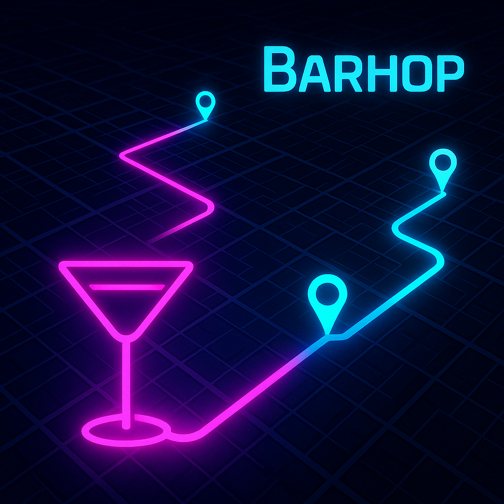
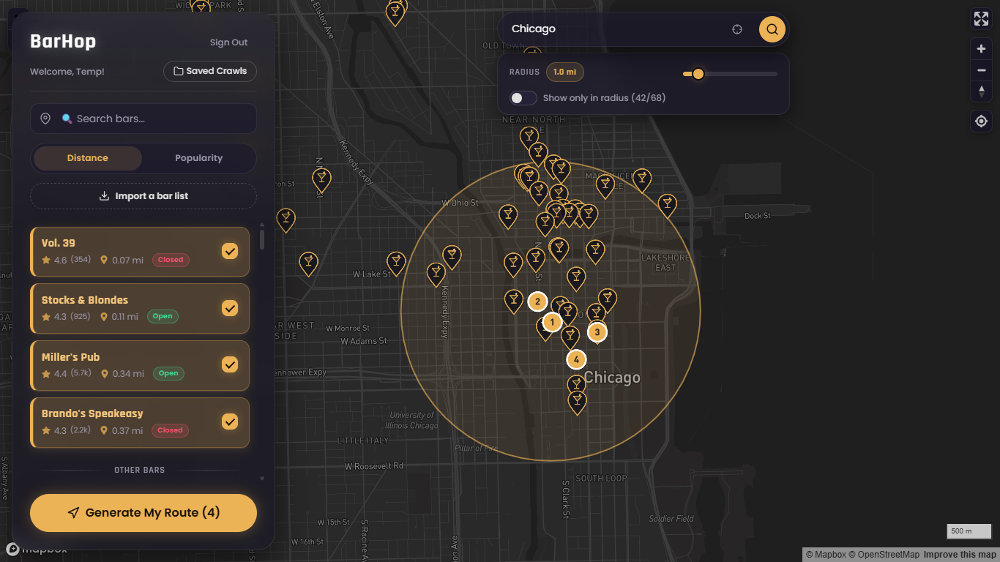
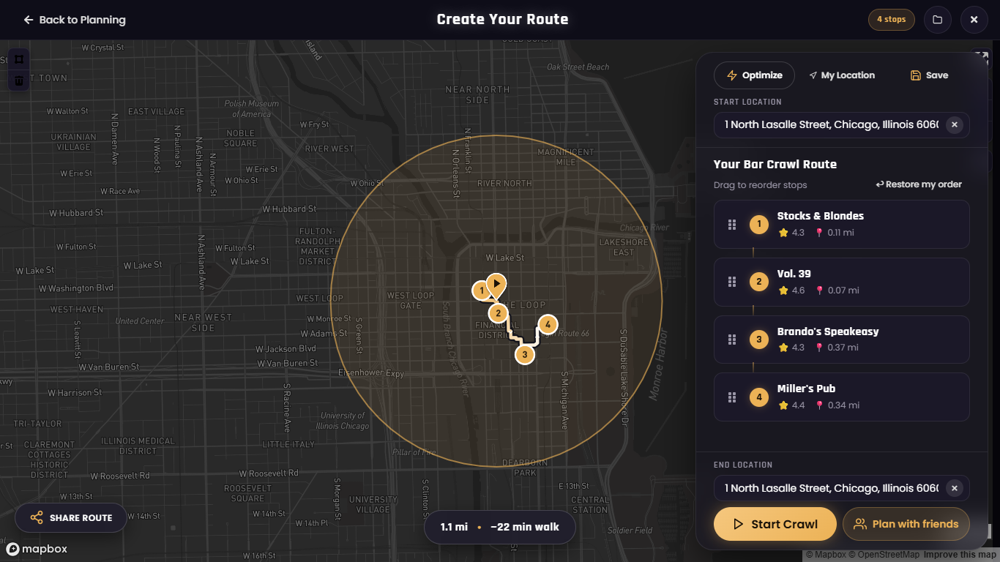
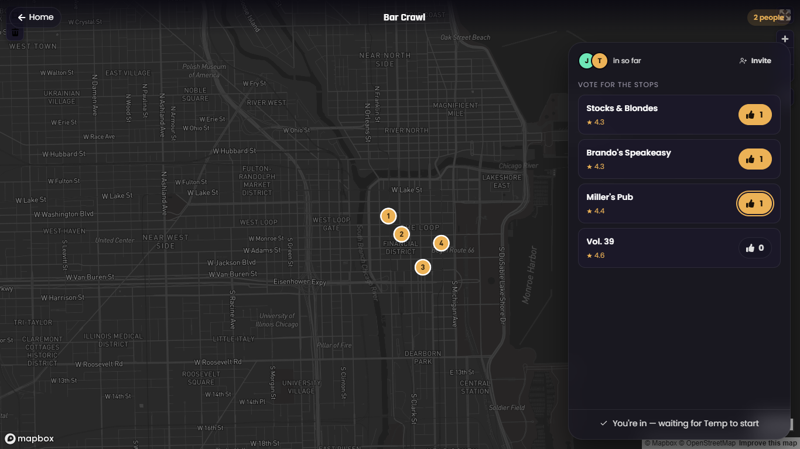
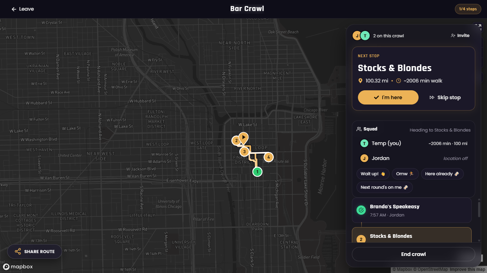
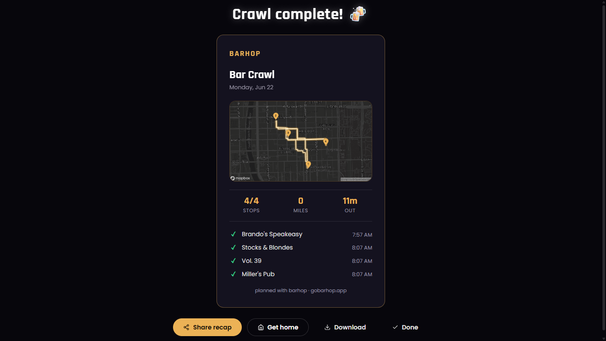

<div align="center">



# BarHop

**Plan, optimize, and share the perfect bar crawl.**

[Live Demo](https://www.gobarhop.app/) · [Report an Issue](https://github.com/y-wani/bar-crawl/issues)


</div>

---

BarHop is a web app for planning a night out. Drop a pin, discover the bars around
you on an interactive map, let the app build the shortest walkable route between
your stops, decide the lineup together with friends, and follow the crawl live as
a group. Built with React, TypeScript, and Mapbox GL JS.

## Showcase

<table>
  <tr>
    <td width="50%" valign="top">
      
      <p align="center"><strong>Discover</strong> — find bars on a live, interactive map.</p>
    </td>
    <td width="50%" valign="top">
      
      <p align="center"><strong>Plan</strong> — an optimized walking route, with distance and time.</p>
    </td>
  </tr>
  <tr>
    <td width="50%" valign="top">
      
      <p align="center"><strong>Vote</strong> — the group decides the lineup together.</p>
    </td>
    <td width="50%" valign="top">
      
      <p align="center"><strong>Crawl live</strong> — track the whole crew in real time.</p>
    </td>
  </tr>
  <tr>
    <td width="50%" valign="top">
      
      <p align="center"><strong>Recap</strong> — a shareable card to end the night.</p>
    </td>
    <td width="50%" valign="top"></td>
  </tr>
</table>

## Features

- **Interactive map discovery** — browse nearby bars on a Mapbox basemap with a
  radius filter, ratings, and live open/closed status.
- **Route optimization** — turn a set of stops into the shortest walkable path,
  with drag-and-drop reordering and real-time distance and duration estimates.
- **Plan together** — share a single link so the whole group can vote on the
  lineup; no account is required to vote, and the top picks build the route.
- **Live multiplayer crawl** — start a crawl and the group follows the same route
  in real time, with current-stop sync and check-ins backed by Firestore.
- **Shareable recap** — every crawl ends with an exportable recap card of stops,
  distance, and timing.
- **Accounts and saved crawls** — Firebase email/password auth with verified
  sign-up, plus saved and shareable crawls.

## Tech Stack

| Area | Technologies |
| --- | --- |
| Frontend | React 19, TypeScript, Vite, Framer Motion |
| Maps & geo | Mapbox GL JS, Mapbox Directions, Turf.js |
| Backend | Firebase Authentication, Cloud Firestore |
| Hosting | Vercel (serverless functions + static hosting) |
| Styling | Hand-authored CSS, custom GLSL swirl background (Three.js) |

## Engineering Highlights

- **Secured third-party API access.** Billed Mapbox and Places requests are
  proxied through authenticated, rate-limited Vercel serverless functions so keys
  are never exposed to the client.
- **Real-time collaboration.** Live Crawl and group voting are built on Firestore
  listeners, keeping every participant's view in sync.
- **Route optimization.** A nearest-neighbour solver orders stops into an
  efficient walking path and surfaces total distance and time before you leave.
- **SEO and discoverability.** Server-readable metadata, JSON-LD structured data
  (`WebApplication`, `Organization`, `FAQPage`), `robots.txt`, and a sitemap.

## Getting Started

### Prerequisites

- Node.js 18 or newer
- A Mapbox access token
- A Firebase project (Authentication + Firestore)

### Installation

```bash
# 1. Clone
git clone https://github.com/y-wani/bar-crawl.git
cd bar-crawl

# 2. Install dependencies
npm install

# 3. Configure environment
cp .env.example .env
# then fill in your Mapbox token and Firebase config in .env

# 4. Start the dev server
npm run dev
```

The app runs at `http://localhost:5173`.

### Environment variables

Copy `.env.example` to `.env` and provide your own values:

```env
VITE_MAPBOX_ACCESS_TOKEN=your_mapbox_token
VITE_FIREBASE_API_KEY=your_firebase_api_key
VITE_FIREBASE_AUTH_DOMAIN=your_project.firebaseapp.com
VITE_FIREBASE_PROJECT_ID=your_project_id
VITE_FIREBASE_STORAGE_BUCKET=your_project.appspot.com
VITE_FIREBASE_MESSAGING_SENDER_ID=your_sender_id
VITE_FIREBASE_APP_ID=your_app_id
```

## Scripts

```bash
npm run dev        # Start the development server
npm run build      # Type-check and build for production
npm run preview    # Preview the production build locally
npm run lint       # Run ESLint
```

## Project Structure

```
src/
├── components/     # Reusable UI components
├── pages/          # Route-level pages (Landing, Home, Route, LiveCrawl, ...)
├── routes/         # App router and route guards
├── hooks/          # Custom React hooks
├── services/       # Firebase and data services
├── context/        # React context providers
├── styles/         # Component and page styles
├── types/          # Shared TypeScript types
└── utils/          # Utility helpers
api/                # Vercel serverless functions (authenticated API proxy)
public/             # Static assets and screenshots
```

## License

This repository is published for portfolio and demonstration purposes. Please
contact the author before reusing the code or assets.
